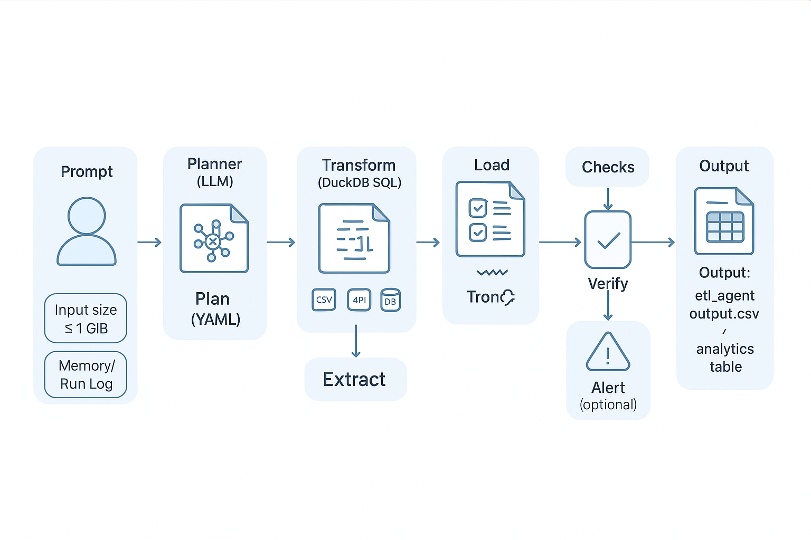
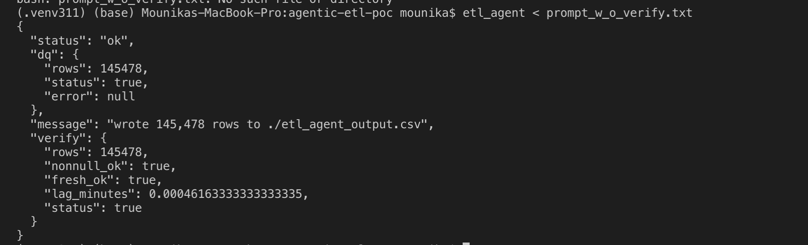
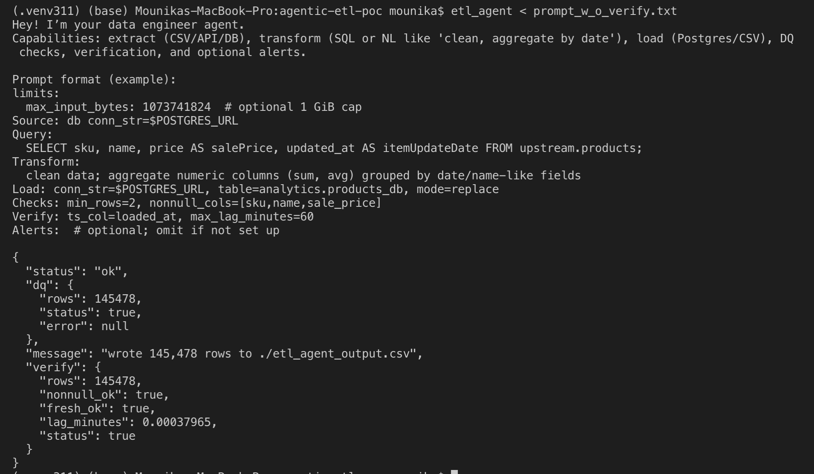
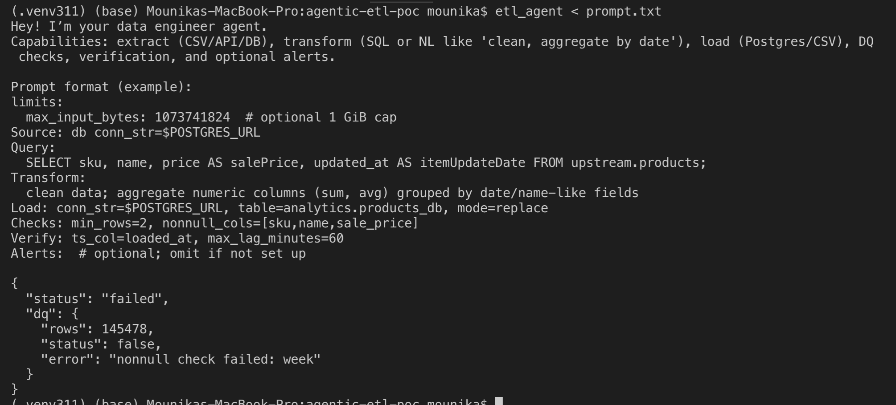

# agentic-etl-poc
An Agentic AI-powered ETL system that builds and runs data pipelines from the user prompts. It interprets user requests, ingests data from sources like APIs or databases, transforms it, loads it into PostgreSQL/Tableau-ready formats, and monitors performance with proactive alerts for seamless analytics.

Prompt→Pipeline ETL Agent

Turn natural-language prompts into ETL runs: extract (csv/api/db), transform (SQL), load (Postgres/CSV), DQ + verify, and alerts.

## Install
```bash
python -m venv .venv && source .venv/bin/activate
pip install -e .
```
## Verify
which etl_agent
etl_agent --help

# simplest way to run your saved prompt
etl_agent < prompt.txt

# or with -p flag
etl_agent -p "$(< prompt.txt)"

# suppress greeting
etl_agent --no-greet < prompt.txt


# ETL flow overview



# ETL agent output with prompt without null checks 



# ETL agent output with prompt with verification of non empty output



# ETL agent output with prompt with DQ checks


# Extendable features
Connecting to Cloud (GCP, AWS)
Adding memory to save past prompts, conversations, results to add more context
Process more than current 1GB limit on files.

New contributions to this are welcomed!
